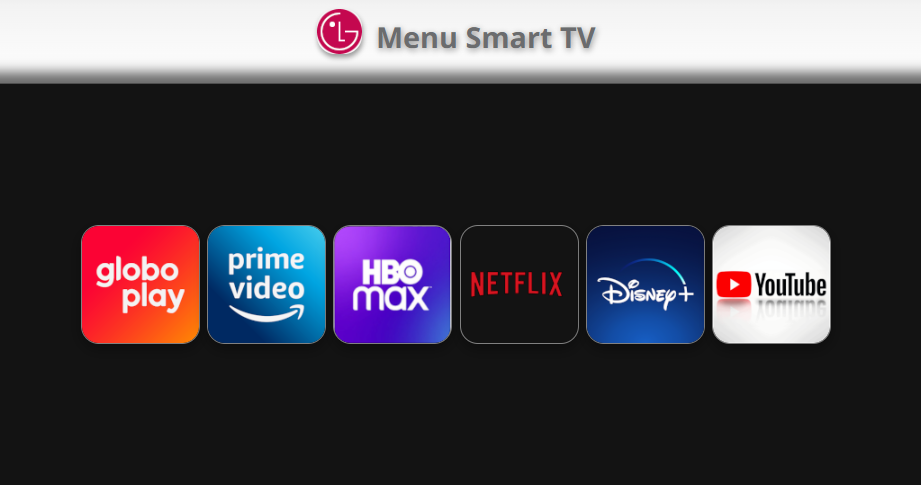
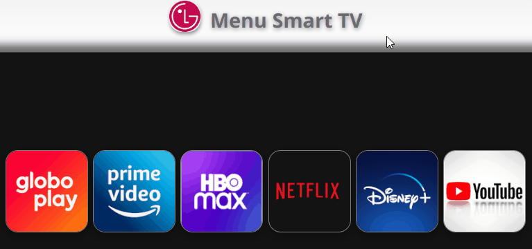

# Menu Smart TV

## O desafio

Este projeto foi pensado, em razão de uma experiência particular minha. Tenho uma TV Smart da LG e no menu de apps dela, apareceu a funcionalidade de deixar a lista ordenada de acordo com os apps mais acessados, portanto, este projeto seguiu esta mesma ideia.

## Demonstração do projeto

### Tecnologias utilizadas
- HTML
- CSS
- Javascript

### Obstáculos
Quando vi o tamanho do desafio (pra mim foi bem difícil), eu recuei um passos e tentei fazer parte do que eu queria em um outro projeto mais fácil(código comentado no final do `index.js`).

Através deste outro código, percebi que precisava criar uma array de objetos, para inserir lá o contador de cliques, que seria usado mais pra frente, dentro do `if`.

Precisei conhecer e aprender a utilizar:
- element - dentro do segundo *`forEach()`* para selecionar o elemento HTML associado ao objeto.
- Método *`sort()`*
- Método *`appendChild()`*

